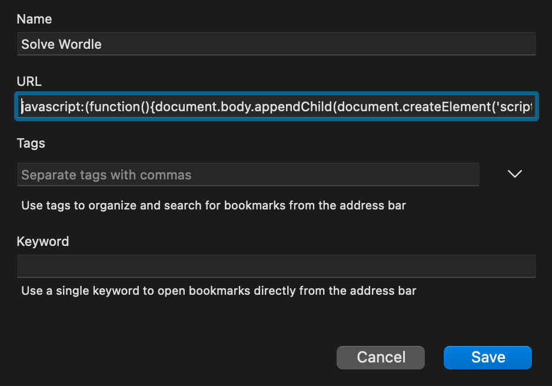

# Wordle Solver

[](https://www.npmjs.com/package/@nfriend/wordle-solver)

A bookmarklet that automatically solves [the daily Wordle
puzzle](https://www.powerlanguage.co.uk/wordle/).

## Demo


## Usage

In your browser of choice, create a new toolbar bookmark. Name the bookmark
something like "Solve Wordle", and paste the following code into the "URL"
field:

<!-- prettier-ignore -->
```js
javascript:(function(){document.body.appendChild(document.createElement('script')).src='https://unpkg.com/@nfriend/wordle-solver/build/index.js';})();
```



Then, navigate to [Wordle](https://www.powerlanguage.co.uk/wordle/) and click
your new "Solve Wordle" bookmarklet!

## Releases

This script is published to [NPM as
`@nfriend/wordle-solver`](https://www.npmjs.com/package/@nfriend/wordle-solver)
and is available as a downloadable script here:
https://unpkg.com/@nfriend/wordle-solver/build/index.js.

## Developing

Clone this repository, and in the root directory, run:

- `yarn`
- `yarn tsc --watch`

`build/index.js` will be automatically updated every time `src/index.ts` is
changed.

To run `build/index.js`, copy its contents and paste into the developer tools of
a Wordle page.
