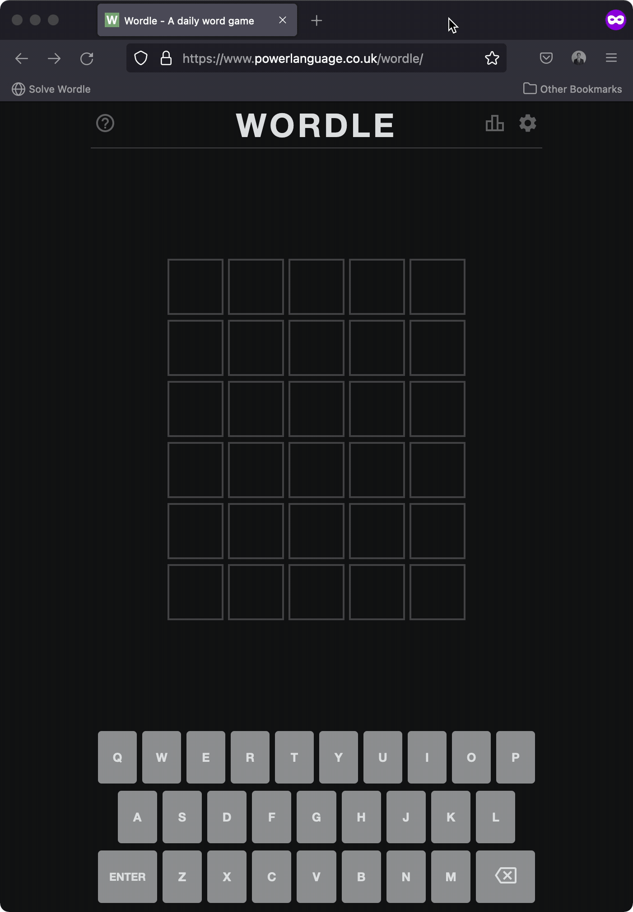
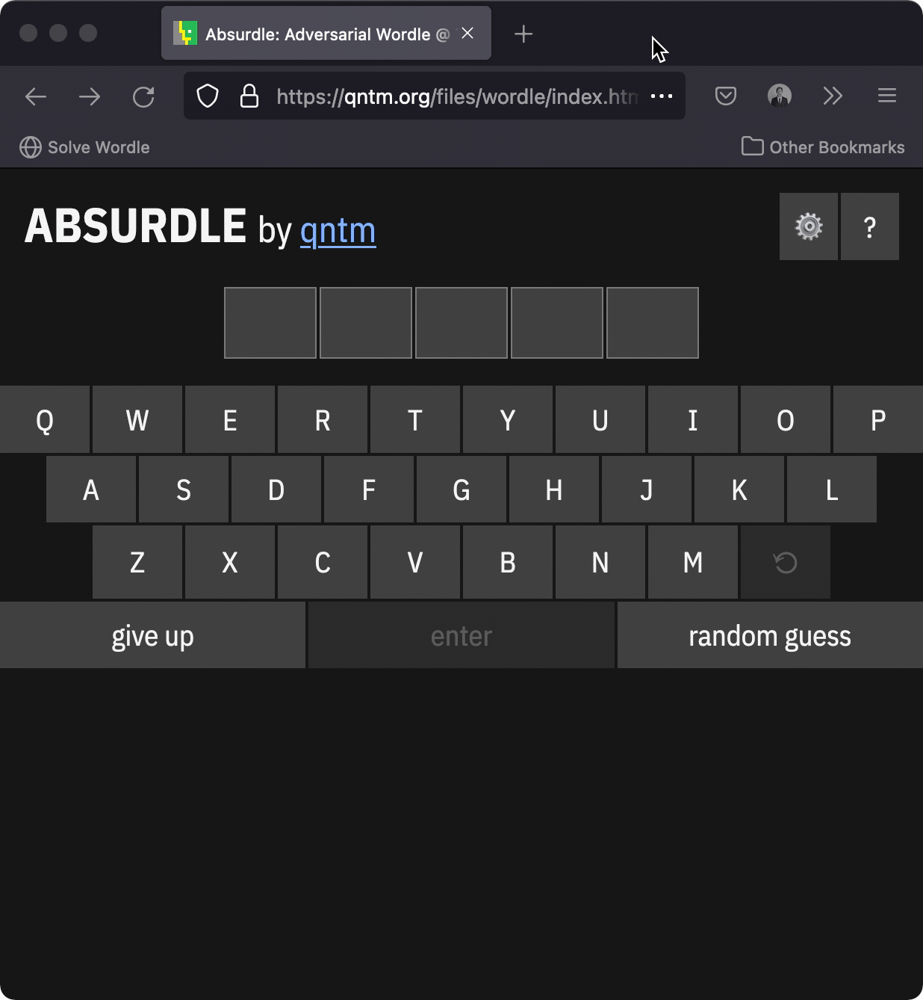
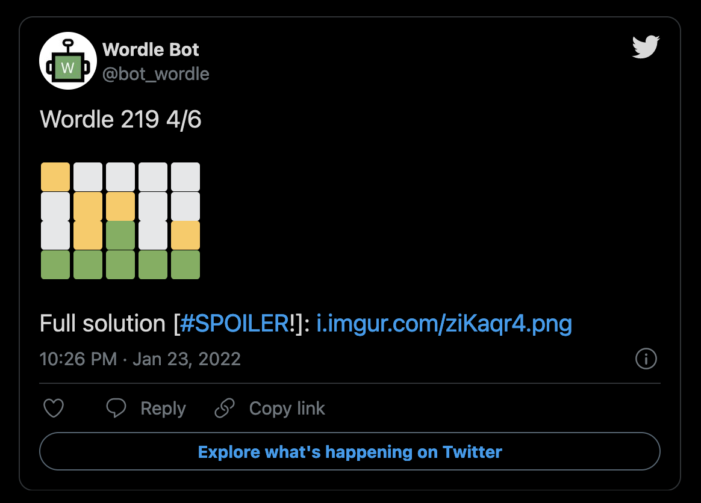
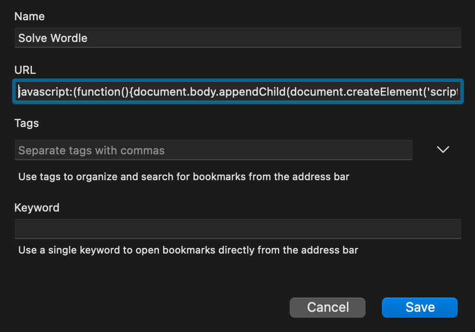

# Wordle (and Absurdle) Solver

[](https://www.npmjs.com/package/@nfriend/wordle-solver)
<a href="https://gitlab.com/nfriend/wordle-solver/pipelines"
  target="_blank"></a> [](https://twitter.com/bot_wordle)


A bookmarklet that automatically solves [the daily Wordle
puzzle](https://www.powerlanguage.co.uk/wordle/).

It also solves a fun variant:
[Absurdle](https://qntm.org/files/wordle/index.html).

## Wordle demo



## Absurdal demo



## Twitter bot

Every morning, [this Twitter bot](https://twitter.com/bot_wordle) uses this
script to solve the daily Wordle puzzle and posts its results.



Source for the Twitter bot can be seen in
[`twitter-bot/index.js`](twitter-bot/index.js). The bot is run inside a GitLab
scheduled pipeline (see [`.gitlab-ci.yml`](.gitlab-ci.yml)).

## Usage

In your browser of choice, create a new toolbar bookmark. Name the bookmark
something like "Solve Wordle", and paste the following code into the "URL"
field:

<!-- prettier-ignore -->
```js
javascript:(function(){document.body.appendChild(document.createElement('script')).src='https://unpkg.com/@nfriend/wordle-solver/build/index.js';})();
```



Then, navigate to [Wordle](https://www.powerlanguage.co.uk/wordle/) or
[Absurdle](https://qntm.org/files/wordle/index.html) and click your new "Solve
Wordle" bookmarklet!

## Releases

This script is published to [NPM as
`@nfriend/wordle-solver`](https://www.npmjs.com/package/@nfriend/wordle-solver)
and is available as a downloadable script here:
https://unpkg.com/@nfriend/wordle-solver/build/index.js.

## Developing

Clone this repository, and in the root directory, run:

- `yarn`
- `yarn tsc --watch`

`build/index.js` will be automatically updated every time `src/index.ts` is
changed.

To run `build/index.js`, copy its contents and paste into the developer tools of
a Wordle or Absurdal page.
